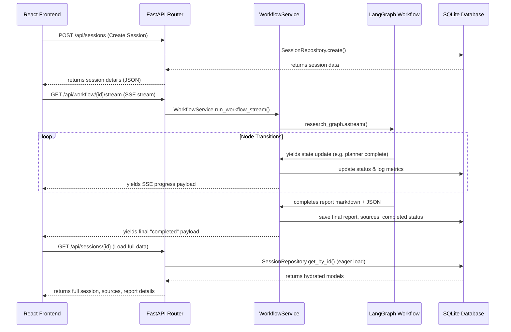

# InsightForge AI - System Architecture

InsightForge AI is structured using a clean, multi-layered service-oriented architecture designed to separate concerns, facilitate local testing, and support high performance and scalability.

---

## 1. System Topology

Below is the conceptual ASCII visualization of the system topology:

```text
┌─────────────────────────────────────────────────────────────┐
│                       React Frontend                        │
│   (Dashboard, Stepper Progress, Report Viewer, Chat UI)     │
└───────────────┬──────────────────────────────▲──────────────┘
                │ HTTP API requests            │ SSE stream
                ▼                              │ (Server-Sent Events)
┌──────────────────────────────────────────────┴──────────────┐
│                    FastAPI Backend Router                   │
│   (/api/sessions, /api/workflow, /api/chat, /health)        │
└───────────────┬─────────────────────────────────────────────┘
                │ invokes business workflows
                ▼
┌─────────────────────────────────────────────────────────────┐
│                        Service Layer                        │
│   (WorkflowService, LLMService, SearchService, ChatService) │
└───────────────┬──────────────────────────────┬──────────────┘
                │ calls                        │ calls
                ▼                              ▼
┌──────────────────────────────┐        ┌─────────────────────┐
│     Repository Layer         │        │    LangGraph        │
│ (SessionRepo, SourceRepo,    │        │    Workflow Graph   │
│  ReportRepo, ChatRepo, Log)  │        │ (Planner -> Search  │
└───────────────┬──────────────┘        │  -> Analysis -> QC  │
                │ SQL queries           │  -> Report)         │
                ▼                       └─────────────────────┘
┌──────────────────────────────┐
│       SQLite Database        │
└──────────────────────────────┘
```

---

## 2. Layer Responsibilities

- **Presentation Layer (React 19 + TypeScript + Vite)**: Handles forms, input validations, SSE event subscription, conditional viewport rendering, and responsive typography layouts.
- **Controller/Router Layer (FastAPI)**: Serves HTTP requests, structures schemas with Pydantic, and returns StreamingResponse objects for SSE events.
- **Service Layer**: 
  - **`WorkflowService`**: Orchestrates graph execution, timing telemetry capture, and DB persistence.
  - **`LLMService`**: Standardizes message compilation for Gemini/OpenAI, and fails over to high-fidelity mocks if API keys are missing.
  - **`SearchService`**: Connects queries to Tavily, with failover generators.
  - **`ChatService`**: Implements restricted prompts parsing JSON-formatted contexts to eliminate hallucinations.
- **LangGraph Workflow**: Executes the 5-node graph (`Planner` -> `Research` -> `Analysis` -> `Quality Check` -> `Report Generator`) sharing data via strongly typed State models.
- **Repository Layer**: Separates raw SQL execution and entity hydration logic from business controllers.
- **Database Layer (SQLite + SQLAlchemy Async)**: Normalizes reports and search findings into distinct queryable structures (`sessions`, `reports`, `sources`, `chat_messages`, `workflow_logs`).

---

## 3. Data Flow



---

## 4. Tradeoffs and Architectural Decisions

### SQLite vs. PostgreSQL
- **Tradeoff**: SQLite was chosen for development speed and zero configuration overhead. It is single-file based which makes testing portable and local.
- **Mitigation**: We utilized SQLAlchemy's async driver (`aiosqlite`) and designed queries that are standard SQL. This allows swapping to a PostgreSQL engine simply by changing the `DATABASE_URL` environment variable.

### EventSource (SSE) vs. WebSockets
- **Tradeoff**: WebSockets support full-duplex communication (reads/writes). Server-Sent Events (SSE) are unidirectional (server to client) but run over standard HTTP, support automatic reconnection, and are much easier to implement and scale behind load balancers.
- **Decision**: Since the LangGraph execution progress only requires streaming status updates from the server to the client, SSE was selected as it is much lighter and matches standard HTTP REST principles.
